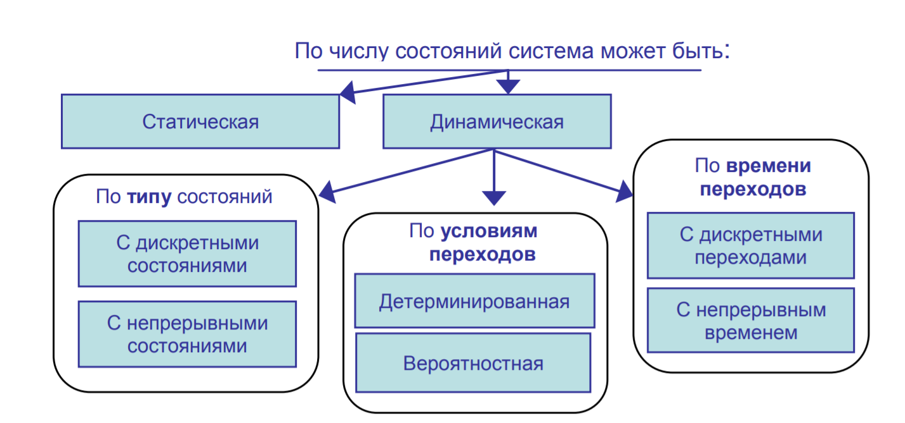

# Моделирование

> **Моделирование** – самое эффективное средство поддержки принятия решений, а по словам Ричарда Докиh3а – «один из самых интересных способов предсказывать будущее»; процесс отражения свойств одного объекта (оригинала) в другом объекте (модели). Это могут быть объекты «как есть» в целом и (или) их отдельные сущности – процессы и явления. Явления – например, поведение животного, состояния погоды – рассматриваются как сложные процессы.

Объект и модель находятся в отношении сходства, т.е. модель по каким-то признакам должна быть подобна изучаемому объекту. Это явление называют **изоморфизмом** (от греч. isos – равный и morphe – форма). Различают три вида подобия:

- Первый вид подобия – подобное масштабирование. Примеры такого подобия: модели автомобилей, самолетов, кораблей сооружений и т.д. 

- Второй вид подобия – косвенное подобие (математическая аналогия). Удачный математический аналог из других областей знаний может сильно упростить построение модели и ее анализ. 

- Третий вид подобия – условное подобие или подобие по соглашению. Примерами являются когнитивные модели (рис. ниже), географические карты, масштабированные чертежи сооружений, зданий, структурные схемы (модели системного анализа). При этом внешне сходство объекта и модели может не соблюдаться. 

Вид и свойства будущей модели определяются целями исследователя, использующего этот инструмент. В модели отражаются свойства объекта, соответствующие этим целям, которые определяют и уровни детализации модели. В первую очередь должны быть определены *существенные* свойства оригинала, характеризующие его как некую проблему, которую нужно решить с помощью модели.

При **верификации**, т.е. проверке достоверности модели, определяется, правильно ли концептуальная модель (модельные допущения) преобразована в компьютерную программу. 

> **Валидация** – это процесс, позволяющий установить, является ли модель точным представлением системы для конкретных целей исследования. 

## Системный подход в моделировании

> **Материальные сущности** – это собрание взаимосвязанных и взаимодействующих элементов, образующих системы разного уровня сложности. 

**Топологическая сложность** определяется числом элементов и связей. Функциональная сложность характеризуется процессами (поведением) системы и ее элементов. По этим признакам можно найти положение данного объекта в иерархии систем (вплоть до мировой) и сформировать предметную область моделирования. 

 **Типовые математические схемы моделирования систем** (*рисунок ниже*): 

- D (dynamic) – модели, вида dx/dt = f(x); 
- Q (queuing) – модели систем массового обслуживания; 
- F (finite automata) – конечные автоматы; 
- P (probabilistic automata) – вероятностные автоматы

## Построение математических моделей

Для реализации соответствующей математической схемы возможно применение двух методов. 

1. Аналитическое моделирование предполагает использование систем алгебраических, дифференциальных, интегральных уравнений, связывающих выходные переменные с входными. Уравнения дополняются системой ограничений. 

   Аналитическое решение можно найти, если параметров не много и система обладает линейным поведением. Главным препятствием в реализации этого метода может оказаться полное или частичное отсутствие «формул» процессов. 

2. Имитационное моделирование. Здесь математическая модель воспроизводит алгоритм («логику») функционирования исследуемой системы во времени при различных сочетаниях значений параметров системы и внешней среды. 

> **Имитационное моделирование** – это построение компьютерных моделей и проведение экспериментов над ними.

Имитационный подход применяют, когда параметров много, зависимости не линейны, система имеет качественно различные состояния (непрерывные процессы прерываются дискретными переходами), траекторию во времени (объект эволюционирует), обладает вероятностным поведением и обратными связями. Имитационный подход незаменим, когда нужно сопроводить модель анимационной презентацией (симуляцией). При создании виртуальных тренажеров, моделей движения транспорта и пешеходов это может оказаться главной задачей моделирования. 

Сочетание имитационного и аналитического методов возможно в рамках одной **комбинированной** модели и способно реализовать практически любые задачи.

## Детерминированные непрерывные системы 

Детерминированные системы с непрерывными переходами состояний моделируются в рамках математических D-схем. Они представляют собой системы дифференциальных и алгебро-дифференциальных уравнений. В таких моделях анализируют изменения параметров системы во времени и определяют ее качественные состояния – режимы.

Выделяют следующие режимы динамики системы: 

1) стационарный – система находится в положении равновесия; 

2) переходный – система движется из одного равновесного состояния в другое; 

3) периодический – система через одинаковые интервалы времени проходит одинаковые состояния; 

4) динамический – состояние системы непрерывно меняется во времени. 

При моделировании физических систем учитывают начальные и конечные состояния, граничные условия (значения параметров на границах системы) и ограничения. 

Рассмотрим простую модель реактора идеального смешения:
$$
dCount/dt = (Cin-Cout)/tav
$$
где Cin и Cout – входная и выходная концентрации реагента; tav – среднее время пребывания реагента в аппарате. Начальными состояниями данной системы будут Cout(t = 0) = 0; Cin(t = 0)>0. Ограничение: tav>0. Если Cin = const, то система может иметь два режима – переходный (пока Cout станет равной входной Cin)

