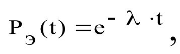
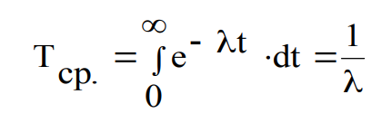
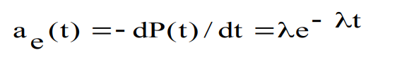
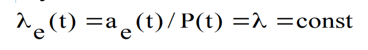
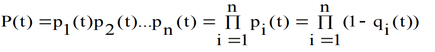
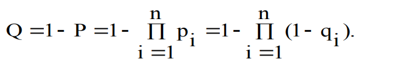
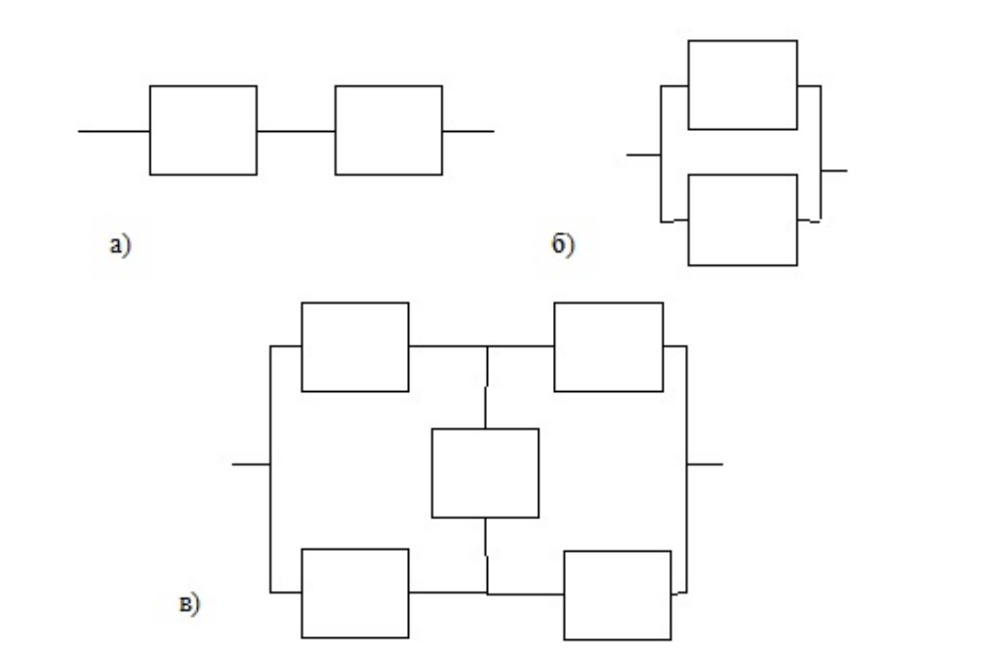

1. Как оценить ожидаемое число ошибок в программе, если использовать модель надежности программ на ранних этапах разработки? 

   К наиболее распространенным количественным характеристикам надежности систем различного назначения относятся 

   вероятность безотказной работы в течение определенного времени – P(t); 

   средняя наработка до первого отказа – Т(ср) ; 

   вероятность отказа – Q(t) ; 

   наработка на отказ – t(ср); 

   частота отказов – a(t); 

   интенсивность отказов.

   Самой распространенной вероятностной моделью надежности является экспоненциальная модель распределения времени до отказа, которая выражается зависимостью.

   

   , где $\lambda$ - параметр модели.

   Для этого закона распределения средняя наработка на отказ равна:

   

   а частота отказа выражается формулой:

   

   Функция интенсивности отказов при экспоненциальной модели равна:

   

2. Что представляют собой структурные схемы надежности с последовательным и параллельным соединением элементов? Как определяются для них показатели надежности? 

   Построение структурной схемы при расчете надежности используется слияние нескольких элементов, соединенных определенным образов, в один – эквивалентный, безотказность работы которого в точности будет равна заменяемой совокупности элементов. При этом рассматриваются типовые схемы соединения элементов – последовательное, параллельное и мостиковое. 

   В системе из последовательно соединенных элементов отказ любого элемента приводит к отказу всей системы (вариант а). Так как отказы элементов являются независимыми, то вероятность одновременной безотказной работы последовательно соединенных n элементов определяется в соответствии с теоремой умножения вероятностей так - вероятность совместного появления независимых событий равна произведению вероятностей этих событий: 

   

   Соответственно, вероятность отказа такой системы составит:

   

   Набор из параллельным соединением элементов представляет собой систему, отказ которой произойдет только в случае, когда откажут всех ее элементы (б). Такие структуры характерны для устройств, в которых элементы дублируются или резервируются, потому что параллельное соединение применяется как основной метод повышения надежности.

   

   Мостиковая структура (в) не приводится ни к параллельному ни к последовательному соединениям. Она представляет собой параллельно соединенные последовательные цепочки элементов с диагональными элементами, которые включены между узлами параллельных ветвей (в).

   Работоспособность мостиковой определяется не только количеством отказавших элементов, но и их положением в структурной схеме. Для расчета надежности мостиковых систем можно воспользоваться методом прямого перебора или метод логических схем с применением алгебры логики. Последний сводится к составлению логического выражения, которое является условием работоспособности системы. Для каждого элемента и системы также используются два противоположных логических состояния - отказ или состояние работоспособности. 

    Реальные технические системы в большинстве своем имеют сложную комбинированную структуру, где отдельные группы элементов могут образовывать последовательные, параллельное, или мостиковые схемы соединений. В этих случаях следует предварительно произвести декомпозицию исходной схемы надежности, разбив ее на простые группы элементов, методика расчета надежности которых известна, после чего заменить эти группы в новой структурной схеме эквивалентными квазиэлементами, вероятности безотказной работы которых будут равны вычисленным вероятностям безотказной работы этих групп. 

3. Для чего используются модели надежности ПО ИС? 

   Для оценки показателей **надежности** **ПО**, **используют** **модели** **надежности**, под которыми понимаются математические **модели**, которые построены для оценки зависимости **надежности** от заранее известных параметров.

4. Какие параметры надежности ПО можно определить с помощью моделей надежности? 

   При оценке и анализе надежности технической системы модели надежности ее элементов, как правило, известны, так как они определяются на этапе их разработки и изготовления. При этом определение надежности элементов производится путем проверки достаточно большого числа этих элементов, с фиксацией сбоев и отказов. Такие модели надежности элементов позволяют получить оценку надежности всего устройства. При оценке надежности программ:

   может быть использовано большое количество разных моделей надежности, описывающих один и тот же процесс; 

   отсутствует универсальная модели надежности, которую можно было бы применить для описания любых программных систем с удовлетворительной точностью; 

   в существующих моделях надежности отсутствует возможность учета «вторичных дефектов»

5. Какие модели надежности относятся к статическим, а какие к динамическим?

   Аналитические модели представлены двумя группами: динамические модели и статические. В *динамических* поведение ПС (появление отказов) рассматривается во времени. В *статических* моделях появление отказов не связывают со временем, а учитывают только зависимость количества ошибок от числа тестовых прогонов (по области ошибок) или зависимость количества ошибок от характеристики входных данных (по области данных).

6. Каковы преимущества и недостатки известных моделей надежности? 

   Преимущества оценки показателей надежности по имитационной модели, создаваемой на основе анализа структуры будущего реально­го ПО, заключаются в том, что модель позволяет уже на этапе проек­тирования ПО принимать рациональные проектные решения, опи­раясь на характеристики ошибок, оцениваемые с помощью имитаци­онной модели. Имитационная модель позволяет прогнозировать тре­буемые ресурсы тестирования, определять меру сложности программ и предсказывать возможное число ошибок.

   К недостаткам можно отнести необходимость дополнительных затрат на составление имитационной модели и приблизительный характер получаемых показателей.

7. С помощью каких моделей можно прогнозировать надежность ПО на этапах разработки ИС? 

   **Аналитические** **модели** дают возможность рассчитать количественные показатели **надежности**, основываясь на данных о поведении программы в процессе тестирования.

   Аналитическое моделирование надежности программной системы состоит из четырех основных этапов:

   1) определение стратегии и конкретного плана процесса тестирования программного средства исходя из задачи обнаружения ошибок; 

   2) выбор или создание математической модели, основанной на принятой стратегии и плане тестирования; 

   3) выбор параметров моделей на основе полученных данных; 4) расчет количественных показателей надежности с использованием построенной модели.

8. Какие существуют методы повышения надежности ПО?

Рассматривая общие принципы обеспечения надежности ПС как один из основных мотивов разработки ПС, определяющим специфику для всем технологических процессов разработки ПС, следует иметь в виду что все они направлены на сокращение количества и степени влияния программных ошибок. При этом используется широкий спектр разнообразных подходов, в наиболее распространенным из которых являются следующие: 

- предупреждение ошибок, включая их обнаружение и исправление; 
- устойчивость к ошибкам;
- проверка на надежность в процессах проектирования;
- снижение сложности программной системы;
- надежные вычисления; 
- обеспечение надежной передачи данных; 
- обеспечение надежного хранения данных; 
- моделирование надежности.

9. Оцените общее число ошибок в тексте программы, если программа проверена тремя специалистами и если первый из них нашел в программе 3 ошибки, второй – 5 ошибок, а третий – 6 ошибок, причем две ошибки из найденных были общими у всех специалистов.

   Для расчета общего числа ошибок необходимо сложить все найденые ошибки, затем, вычесть из суммы всех найденых ошибок повторяющиеся ошибки умноженных на количество повторных нахождений.

   Общее число ошибок = 3 + 5 + 6 - 2 * 3 = 8

10. Напишите программу для обнаружения однократной ошибки на основе контроля четности

### Подготовка

Допустим, у нас есть сообщение «habr», которое необходимо передать без ошибок. Для этого сначала нужно наше сообщение закодировать при помощи Кода Хэмминга. Нам необходимо представить его в бинарном виде.

На этом этапе стоит определиться с, так называемой, длиной информационного слова, то есть длиной строки из нулей и единиц, которые мы будем кодировать. Допустим, у нас длина слова будет равна 16. Таким образом, нам необходимо разделить наше исходное сообщение («habr») на блоки по 16 бит, которые мы будем потом кодировать отдельно друг от друга. Так как один символ занимает в памяти 8 бит, то в одно кодируемое слово помещается ровно два ASCII символа. Итак, мы получили две бинарные строки по 16 бит:

 и 

После этого процесс кодирования распараллеливается, и две части сообщения («ha» и «br») кодируются независимо друг от друга. Рассмотрим, как это делается на примере первой части.
Прежде всего, необходимо вставить контрольные биты. Они вставляются в строго определённых местах — это позиции с номерами, равными степеням двойки. В нашем случае (при длине информационного слова в 16 бит) это будут позиции 1, 2, 4, 8, 16. Соответственно, у нас получилось 5 контрольных бит (выделены красным цветом):

Было:

Стало:

Таким образом, длина всего сообщения увеличилась на 5 бит. До вычисления самих контрольных бит, мы присвоили им значение «0».

### Вычисление контрольных бит.

Теперь необходимо вычислить значение каждого контрольного бита. Значение каждого контрольного бита зависит от значений информационных бит (как неожиданно), но не от всех, а только от тех, которые этот контрольных бит контролирует. Для того, чтобы понять, за какие биты отвечает каждых контрольный бит необходимо понять очень простую закономерность: контрольный бит с номером N контролирует все последующие N бит через каждые N бит, начиная с позиции N. Не очень понятно, но по картинке, думаю, станет яснее:

Здесь знаком «X» обозначены те биты, которые контролирует контрольный бит, номер которого справа. То есть, к примеру, бит номер 12 контролируется битами с номерами 4 и 8. Ясно, что чтобы узнать какими битами контролируется бит с номером N надо просто разложить N по степеням двойки.

Но как же вычислить значение каждого контрольного бита? Делается это очень просто: берём каждый контрольный бит и смотрим сколько среди контролируемых им битов единиц, получаем некоторое целое число и, если оно чётное, то ставим ноль, в противном случае ставим единицу. Вот и всё! Можно конечно и наоборот, если число чётное, то ставим единицу, в противном случае, ставим 0. Главное, чтобы в «кодирующей» и «декодирующей» частях алгоритм был одинаков. (Мы будем применять первый вариант).
Высчитав контрольные биты для нашего информационного слова получаем следующее:

и для второй части:

Вот и всё! Первая часть алгоритма завершена.

### Декодирование и исправление ошибок.

Теперь, допустим, мы получили закодированное первой частью алгоритма сообщение, но оно пришло к нас с ошибкой. К примеру мы получили такое (11-ый бит передался неправильно):

Вся вторая часть алгоритма заключается в том, что необходимо заново вычислить все контрольные биты (так же как и в первой части) и сравнить их с контрольными битами, которые мы получили. Так, посчитав контрольные биты с неправильным 11-ым битом мы получим такую картину:

Как мы видим, контрольные биты под номерами: 1, 2, 8 не совпадают с такими же контрольными битами, которые мы получили. Теперь просто сложив номера позиций неправильных контрольных бит (1 + 2 + 8 = 11) мы получаем позицию ошибочного бита. Теперь просто инвертировав его и отбросив контрольные биты, мы получим исходное сообщение в первозданном виде! Абсолютно аналогично поступаем со второй частью сообщения.

​    

​    

​    

​    

​    

​    

   Здесь знаком «X» обозначены те биты, которые контролирует контрольный бит, номер которого справа. То есть, к примеру, бит номер 12 контролируется битами с номерами 4 и

   \8. Ясно, что чтобы узнать какими битами контролируется бит с номером N надо просто разложить N по степеням двойки.

   Но как же вычислить значение каждого контрольного бита? Делается это очень просто: берём каждый контрольный бит и смотрим сколько среди контролируемых им битов единиц, получаем некоторое целое число и, если оно чётное, то ставим ноль, в противном случае ставим единицу. Вот и всё! Можно конечно и наоборот, если число чётное, то ставим единицу, в противном случае, ставим 0. Главное, чтобы в «кодирующей» и

   

«декодирующей» частях алгоритм был одинаков. (Мы будем применять первый вариант). Высчитав контрольные биты для нашего информационного слова получаем следующее:

​    

​    

​    

|      |                                                              |
| ---- | ------------------------------------------------------------ |
|      |  |

   и для второй части:

   

   Вот и всё! Первая часть алгоритма завершена.

   

   

**Декодирование и исправление ошибок****.**Теперь, допустим, мы получили закодированное первой частью алгоритма сообщение, но оно пришло к нас с ошибкой. К примеру мы получили такое (11-ый бит передался неправильно):

​    

​    

   

Вся вторая часть алгоритма заключается в том, что необходимо заново вычислить все контрольные биты (так же как и в первой части) и сравнить их с контрольными битами, которые мы получили. Так, посчитав контрольные биты с неправильным 11-ым битом мы получим такую картину:

​    

​    

   Как мы видим, контрольные биты под номерами: 1, 2, 8 не совпадают с такими же контрольными битами, которые мы получили. Теперь просто сложив номера позиций неправильных контрольных бит (1 + 2 + 8 = 11) мы получаем позицию ошибочного бита. Теперь просто инвертировав его и отбросив контрольные биты, мы получим исходное сообщение в первозданном виде! Абсолютно аналогично поступаем со второй частью сообщения.